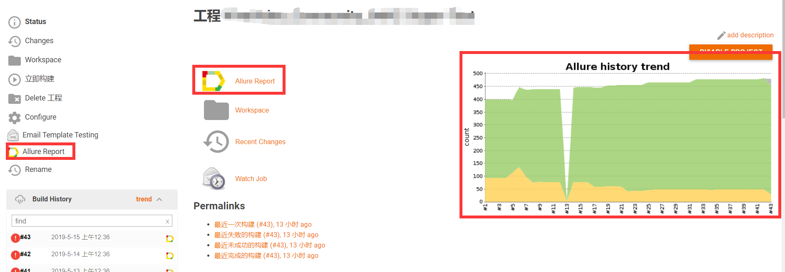
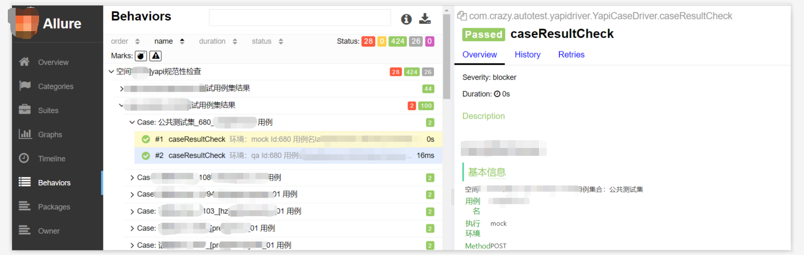
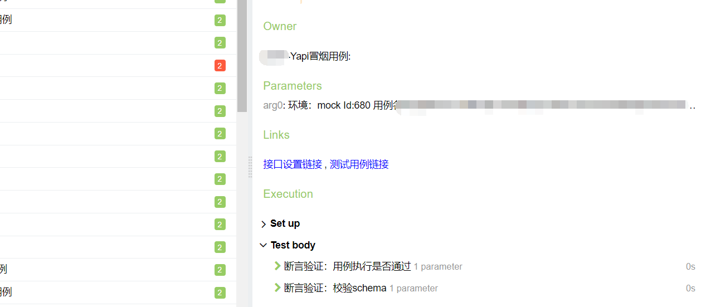
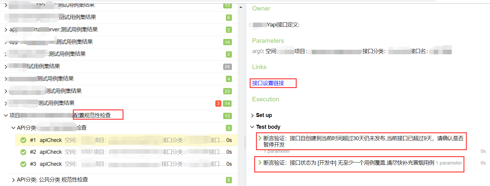

## yapi 接口监控工具
集成yapi testng allure2，在allure2 测试报告中显示yapi接口定义情况，执行yapi中的接口用例

## 强烈推荐 yapi接口监控平台

<a target="_blank" href="http://yapi.demo.qunar.com">yapi.demo.qunar.com</a>

## 使用说明

    1. 框架环境testng+allure2+yapi+maven+jdk8.0
    2. 下载工程
    3. 修改配置文件resources/config/yapi/projectinfo.properties

        yapi.addr=restapi.xxx.com    本地yapi的域名
        admin.Email=xxx@xxx.com       管理员账号，或者是需要监控的空间的组长账号
        admin.pwd=1234567     密码

        #被监控测试的groupId
        spaceIds=622   默认需要监控的空间id，id获取方式：登陆yapi后，打开一个空间，在url中..../group/622
     4. 执行maven命令
        clean test -Dsuite=yapi.xml -Dallure.results.directory=target/allure-results -DspaceIds=57
     5. -DspaceIds值可选形式如下
        不传该参数：使用projectinfo.properties中的默认配置
        传一个值监控一个空间：-DspaceIds=57
        传入多个值监控多个空间：-DspaceIds=57,22
        执行结束后，在当前工程目录下执行：allure serve target/allure-results 查看allure格式化结果的报告
     6. 可集成jenkins 自行网搜解决方案（样例见下图）

 

## 报告截图

